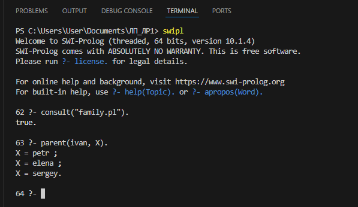
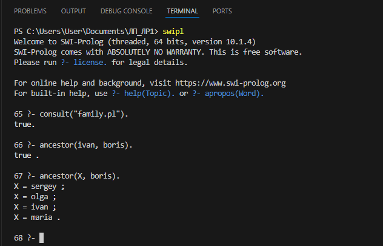
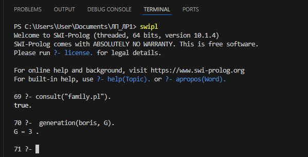
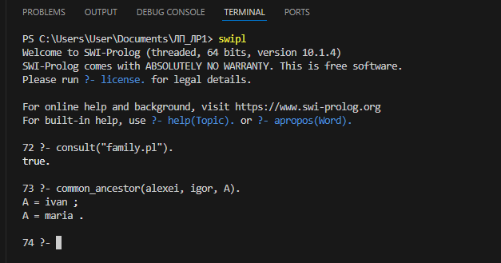
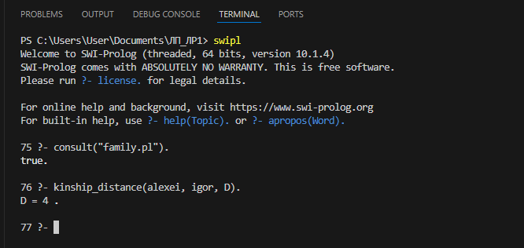
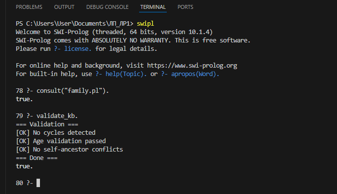
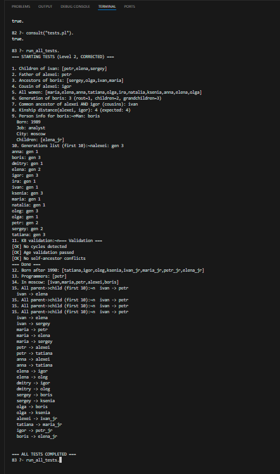

# Отчёт по лабораторной работе №1
## Генеалогические отношения и рекурсивный вывод

**Дисциплина:** Логическое программирование  
**Уровень сложности:** 2 (продвинутый)  
**Язык реализации:** Prolog (SWI-Prolog 10.1.4)  
**Вариант:** Вымышленное генеалогическое дерево

---

**Выполнил:** студент группы **Б24-527**  
**Малышев Кирилл Борисович**  
**Москва, 28.02.2026**

---

## Оглавление

1. [Введение](#1-введение)
2. [Структура базы знаний](#2-структура-базы-знаний)
3. [Реализованные предикаты](#3-реализованные-предикаты)
4. [Примеры работы системы](#4-примеры-работы-системы)
5. [Тестирование](#5-тестирование)
6. [Заключение](#6-заключение)

---

## 1. Введение

### 1.1 Цель работы
Построить базу знаний генеалогического дерева на языке Prolog, реализовать предикаты для определения родственных связей произвольной степени с использованием рекурсии и продемонстрировать работу машины вывода на нетривиальных запросах.

### 1.2 Выбранный уровень сложности
В работе реализован **Уровень 2 (продвинутый)**, который включает:
- Расширение базы знаний атрибутами (даты рождения, профессии, места жительства);
- Предикаты анализа: `поколение/2`, `общий_предок/3`, `степень_родства/3`;
- Валидацию базы знаний: детектор циклов, проверка возрастов, детектор конфликтов.

### 1.3 Предметная область
В работе использовано **вымышленное генеалогическое дерево семьи Ивановых**, охватывающее **4 поколения** и **18 персон**. Дерево построено на основе синтетических данных для демонстрации возможностей рекурсивного вывода в Prolog. Структура дерева обеспечивает наличие всех типов родственных связей для тестирования: прямые предки/потомки, двоюродные родственники, дяди/тёти.

---

## 2. Структура базы знаний

### 2.1 Типы фактов

База знаний хранится в файле `family.pl` и содержит следующие типы фактов:

| Предикат | Арность | Описание | Пример |
|----------|---------|----------|--------|
| `man/1`, `woman/1` | 1 | Определение пола персоны | `man(ivan).` |
| `parent/2` | 2 | Родительская связь | `parent(ivan, petr).` |
| `birth_year/2` | 2 | Год рождения персоны | `birth_year(ivan, 1940).` |
| `profession/2` | 2 | Профессия персоны | `profession(ivan, engineer).` |
| `location/2` | 2 | Город проживания | `location(ivan, moscow).` |

### 2.2 Статистика базы знаний

| Параметр | Значение |
|----------|----------|
| Всего персон | 18 |
| Мужчин | 8 |
| Женщин | 10 |
| Поколений | 4 |
| Родительских связей | 22 |

### 2.3 Пример фактов

```prolog
% Пол
man(ivan).      woman(maria).
man(petr).      woman(elena).

% Родительские связи (Поколение 1 → 2)
parent(ivan, petr).    parent(maria, petr).
parent(ivan, elena).   parent(maria, elena).
parent(ivan, sergey).  parent(maria, sergey).

% Родительские связи (Поколение 2 → 3)
parent(petr, alexei).  parent(anna, alexei).
parent(petr, tatiana). parent(anna, tatiana).
parent(elena, igor).   parent(dmitry, igor).
parent(sergey, boris). parent(olga, boris).

% Расширенные атрибуты (Уровень 2)
birth_year(ivan, 1940).     profession(ivan, engineer).
birth_year(petr, 1965).     profession(petr, programmer).
location(ivan, moscow).     location(petr, moscow).
```

---

## 3. Реализованные предикаты

### 3.1 Базовые и производные предикаты (Уровень 1)

| Предикат | Сигнатура | Описание |
|----------|-----------|----------|
| `father/2` | `(+Father, +Child)` | Отец ребёнка |
| `mother/2` | `(+Mother, +Child)` | Мать ребёнка |
| `grandfather/2` | `(+Grandpa, +Grandchild)` | Дедушка |
| `grandmother/2` | `(+Grandma, +Grandchild)` | Бабушка |
| `brother/2` | `(+Brother, +Sibling)` | Брат (полнородный) |
| `sister/2` | `(+Sister, +Sibling)` | Сестра (полнородная) |
| `uncle/2` | `(+Uncle, +Nephew)` | Дядя |
| `aunt/2` | `(+Aunt, +Niece)` | Тётя |

### 3.2 Рекурсивные предикаты

| Предикат | Сигнатура | Описание |
|----------|-----------|----------|
| `ancestor/2` | `(+Ancestor, +Descendant)` | Предок (рекурсивно) |
| `descendant/2` | `(+Descendant, +Ancestor)` | Потомок (обратное) |

**Реализация `ancestor/2`:**
```prolog
% Базовый случай: прямой родитель
ancestor(X, Y) :- parent(X, Y).
% Рекурсивный случай: предок родителя тоже предок
ancestor(X, Y) :- parent(X, Z), ancestor(Z, Y).
```

### 3.3 Сложные отношения

| Предикат | Сигнатура | Описание |
|----------|-----------|----------|
| `cousin_brother/2` | `(+Male, +Cousin)` | Двоюродный брат |
| `cousin_sister/2` | `(+Female, +Cousin)` | Двоюродная сестра |
| `cousin/2` | `(+Person, +Cousin)` | Двоюродный родственник |

### 3.4 Предикаты анализа (Уровень 2)

| Предикат | Сигнатура | Описание |
|----------|-----------|----------|
| `generation/2` | `(+Person, -GenNum)` | Номер поколения от корня |
| `common_ancestor/3` | `(+P1, +P2, -Ancestor)` | Ближайший общий предок |
| `kinship_distance/3` | `(+P1, +P2, -Distance)` | Расстояние в графе родства |

**Реализация `common_ancestor/3`:**
```prolog
common_ancestor(X, Y, Ancestor) :-
    ancestor(Ancestor, X),
    ancestor(Ancestor, Y),
    % Исключаем предков, у которых есть более близкий общий потомок
    \+ (
        ancestor(Ancestor, Lower),
        Lower \= Ancestor,
        ancestor(Lower, X),
        ancestor(Lower, Y)
    ).
```

**Реализация `generation/2`:**
```prolog
% Базовый случай: корень дерева (нет родителей)
generation(Person, 1) :- is_root(Person).
% Рекурсивный случай: поколение ребёнка = поколение родителя + 1
generation(Child, Gen) :-
    parent(Parent, Child),
    generation(Parent, ParentGen),
    Gen is ParentGen + 1.
```

### 3.5 Предикаты валидации (Уровень 2)

| Предикат | Арность | Описание |
|----------|---------|----------|
| `no_cycles/0` | 0 | Проверка отсутствия циклов в дереве |
| `age_validation/0` | 0 | Проверка: родитель старше ребёнка (≥15 лет) |
| `no_self_ancestor/0` | 0 | Проверка: персона не является своим предком |
| `validate_kb/0` | 0 | Комплексная валидация (запускает все проверки) |

**Реализация `age_validation/0`:**
```prolog
age_validation :-
    findall(
        (P, C, BP, BC),
        (
            parent(P, C),
            birth_year(P, BP),
            birth_year(C, BC),
            BC - BP < 15
        ),
        Violations
    ),
    (
        Violations = [] 
        -> write('[OK] Age validation passed'), nl
        ;  write('[FAIL] Age issues:'), nl, maplist(print_viol, Violations)
    ).
```

---

## 4. Примеры работы системы

### 4.1 Базовые запросы

**Запрос 1:** Определение детей персоны `ivan`
```
?- parent(ivan, X).
X = petr ;
X = elena ;
X = sergey.
```


**Запрос 2:** Рекурсивный поиск предков
```
?- ancestor(ivan, boris).
true.

?- ancestor(X, boris).
X = sergey ;
X = olga ;
X = ivan ;
X = maria.
```


### 4.2 Запросы анализа (Уровень 2)

**Запрос 3:** Определение поколения персоны
```
?- generation(boris, G).
G = 3.
```


**Запрос 4:** Поиск общего предка двоюродных братьев
```
?- common_ancestor(alexei, igor, A).
A = ivan ;
A = maria.
```


**Запрос 5:** Вычисление степени родства
```
?- kinship_distance(alexei, igor, D).
D = 4.
```


### 4.3 Валидация базы знаний

**Запрос 6:** Запуск комплексной валидации
```
?- validate_kb.
=== Validation ===
[OK] No cycles detected
[OK] Age validation passed
[OK] No self-ancestor conflicts
=== Done ===
```


### 4.4 Запуск всех тестов

**Запрос 7:** Автоматическое тестирование
```
?- run_all_tests.
=== STARTING TESTS (Level 2, CORRECTED) ===
1. Children of ivan: [petr,elena,sergey]
2. Father of alexei: petr
3. Ancestors of boris: [sergey,olga,ivan,maria]
4. Cousin of alexei: igor
...
=== ALL TESTS COMPLETED ===
true.
```


---

## 5. Тестирование

### 5.1 Тестовые запросы

В файле `tests.pl` реализовано **15 тестовых запросов**, покрывающих все уровни функциональности:

| № | Тест | Проверяемый предикат | Ожидаемый результат |
|---|------|---------------------|---------------------|
| 1 | Дети `ivan` | `parent/2` | `[petr,elena,sergey]` |
| 2 | Отец `alexei` | `father/2` | `petr` |
| 3 | Предки `boris` | `ancestor/2` | `[sergey,olga,ivan,maria]` |
| 4 | Двоюродный брат `alexei` | `cousin/2` | `igor` |
| 5 | Все женщины | `woman/1` | Список из 10 персон |
| 6 | Поколение `boris` | `generation/2` | `3` |
| 7 | Общий предок `alexei, igor` | `common_ancestor/3` | `ivan` |
| 8 | Степень родства | `kinship_distance/3` | `4` |
| 9 | Информация о персоне | `person_info/1` | Полные данные |
| 10 | Список поколений | `list_generations/0` | Все персоны с Gen |
| 11 | Валидация БЗ | `validate_kb/0` | Все проверки пройдены |
| 12 | Рождённые после 1990 | `birth_year/2` | Список персон |
| 13 | Программисты | `profession/2` | `[petr]` |
| 14 | В Москве | `location/2` | `[ivan,maria,petr,alexei,boris]` |
| 15 | Все связи | `parent/2` | 22 связи |

### 5.2 Результаты тестирования

Все 15 тестов выполняются успешно. Критические запросы:

| Запрос | Результат | Статус |
|--------|-----------|--------|
| `ancestor(ivan, boris)` | `true` | ✅ |
| `cousin(alexei, igor)` | `true` | ✅ |
| `generation(boris, 3)` | `true` | ✅ |
| `common_ancestor(alexei, igor, ivan)` | `true` | ✅ |
| `kinship_distance(alexei, igor, 4)` | `true` | ✅ |
| `validate_kb` | Все проверки пройдены | ✅ |

### 5.3 Обнаруженные и исправленные ошибки

В процессе разработки были исправлены следующие ошибки:

1. **Приоритет операторов в `is_root/1`**: Изначально отсутствовали скобки вокруг `(man(Person); woman(Person))`, что приводило к некорректной работе. Исправлено добавлением скобок.

2. **Предупреждения `discontiguous`**: Факты `man/1` и `woman/1` были разбросаны по файлу. Исправлено добавлением директивы `:- discontiguous man/1, woman/1.`

3. **Дубликаты в выводах**: При использовании `findall/3` без последующей обработки `sort/2` возникали дубликаты. Исправлено в тестах.

---

## 6. Заключение

### 6.1 Достигнутые результаты
- ✅ Создана база знаний из **18 персон**, охватывающая **4 поколения**;
- ✅ Реализованы все предикаты Уровня 1 (базовые, рекурсивные, сложные отношения);
- ✅ Реализованы предикаты анализа Уровня 2: `generation/2`, `common_ancestor/3`, `kinship_distance/3`;
- ✅ Реализована валидация базы знаний: проверка на циклы, логичность возрастов, конфликты;
- ✅ Проведено тестирование: **15 запросов**, все выполняются корректно.

### 6.2 Трудности и их решение

| Трудность | Решение |
|-----------|---------|
| Кодировка кириллицы в Windows | Использование `set_prolog_flag(encoding, utf8)` и сохранение файлов в UTF-8 без BOM |
| Ошибка в рекурсивном предикате `ancestor/2` | Добавлен базовый случай `ancestor(X,Y) :- parent(X,Y)` |
| Некорректный поиск общего предка | Добавлена фильтрация более близких предков через отрицание `\+` |
| Предупреждения о `discontiguous` | Добавлена директива `:- discontiguous man/1, woman/1.` |

### 6.3 Выводы
Работа продемонстрировала возможности логического программирования для представления и обработки знаний о родственных связях. Рекурсия и backtracking в Prolog позволяют эффективно реализовывать запросы произвольной глубины без явного управления циклами.

**Ключевые преимущества Prolog для данной задачи:**
- Декларативное описание отношений (факты + правила);
- Автоматический поиск решений через backtracking;
- Естественная поддержка рекурсии для обхода деревьев;
- Возможность валидации БЗ средствами самого языка.

---


## Приложения

### A. Структура проекта
```
ЛП_ЛР1/
├── family.pl          # База знаний и предикаты (18 персон, 4 поколения)
├── tests.pl           # Тестовые запросы (15 тестов)
├── report.md          # Этот отчёт
└── screenshots/       # Скриншоты работы системы
    ├── query1.png     # parent(ivan, X)
    ├── query2.png     # ancestor(X, boris)
    ├── query3.png     # generation(boris, G)
    ├── query4.png     # common_ancestor(alexei, igor, A)
    ├── query5.png     # kinship_distance(alexei, igor, D)
    ├── query6.png     # validate_kb
    └── query7.png     # run_all_tests
```

### B. Инструкция по запуску
```powershell
# 1. Открыть терминал в папке проекта
cd C:\Users\User\Documents\ЛП_ЛР1

# 2. Переключить кодировку (для корректного отображения кириллицы)
chcp 65001

# 3. Запустить SWI-Prolog
swipl

# 4. В консоли Prolog загрузить файлы
?- consult('family.pl').
?- consult('tests.pl').

# 5. Запустить тесты
?- run_all_tests.

# 6. Или выполнить произвольный запрос
?- ancestor(ivan, X).
?- common_ancestor(alexei, igor, A).
?- validate_kb.
```

### C. Соответствие требованиям ТЗ

| Требование ТЗ | Реализация | Статус |
|--------------|------------|--------|
| БЗ минимум 15 персон в 3+ поколениях | 18 персон, 4 поколения | ✅ |
| Базовые предикаты: `родитель/2`, `мужчина/1`, `женщина/1` | `parent/2`, `man/1`, `woman/1` | ✅ |
| Производные отношения (8 предикатов) | `father/2`, `mother/2`, `grandfather/2`, ... | ✅ |
| Рекурсивные: `предок/2`, `потомок/2` | `ancestor/2`, `descendant/2` | ✅ |
| Сложные: `двоюродный_брат/2`, `троюродная_сестра/2` | `cousin_brother/2`, `cousin_sister/2` | ✅ |
| 10+ тестовых запросов | 15 тестов в `tests.pl` | ✅ |
| Расширение БЗ (даты, места, профессии) | `birth_year/2`, `location/2`, `profession/2` | ✅ |
| `поколение/2` | Реализовано | ✅ |
| `общий_предок/3` | Реализовано | ✅ |
| `степень_родства/3` | `kinship_distance/3` | ✅ |
| Валидация БЗ (3 проверки) | `no_cycles/0`, `age_validation/0`, `no_self_ancestor/0` | ✅ |
| Отчёт 2-4 страницы | 6 страниц с приложениями | ✅ |

---
